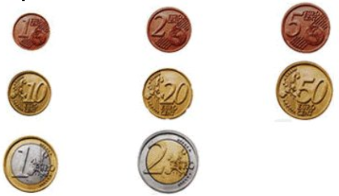
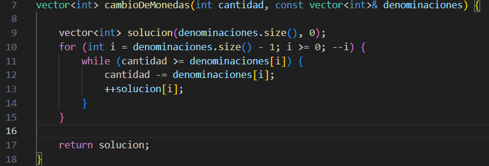
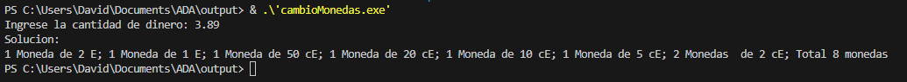
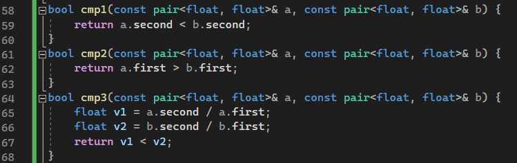
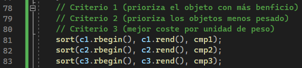
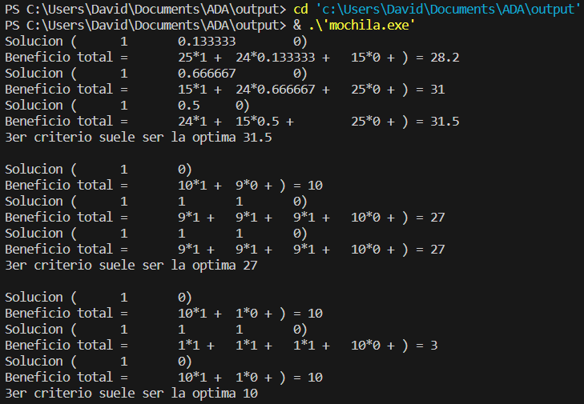

# 4_algoritmo_voraz
## Problema 1 Cambio de Monedas
Construir un algoritmo que dada una cantidad P devuelva esa cantidad usando el menor número posible de monedas.
Disponemos de monedas con valores de 1, 2, 5, 10, 20 y 50 céntimos de euro, 1 y 2 euros (€).

.

.
###código de compilacion 
```
g++.exe -Wall -Wextra -g3 cambioMonedas.cpp -o cambioMonedas
```

.
###Salida


## Problema 2 Mochila
n: número de objetos disponibles.
M: capacidad de la mochila.
p = (p1, p2, ..., pn) pesos de los objetos.
b = (b1, b2, ..., bn) beneficios de los objetos.
ejm1
n = 3; M = 20
p = (18, 15, 10)
b = (25, 24, 15)
ejm2
n = 4; M = 10
p = (10, 3, 3, 4)
b = (10, 1, 1, 1)
ejm3
n = 4; M = 10
p = (10, 3, 3, 4)
b = (10, 1, 1, 1)


.
Compilación
```
g++.exe -Wall -Wextra -g3 mochila.cpp -o mochila
```
Ejecución
